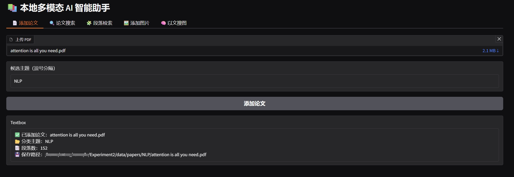
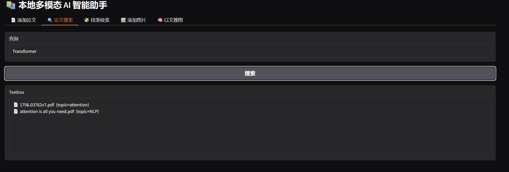
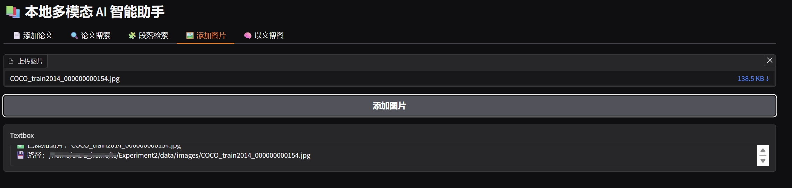
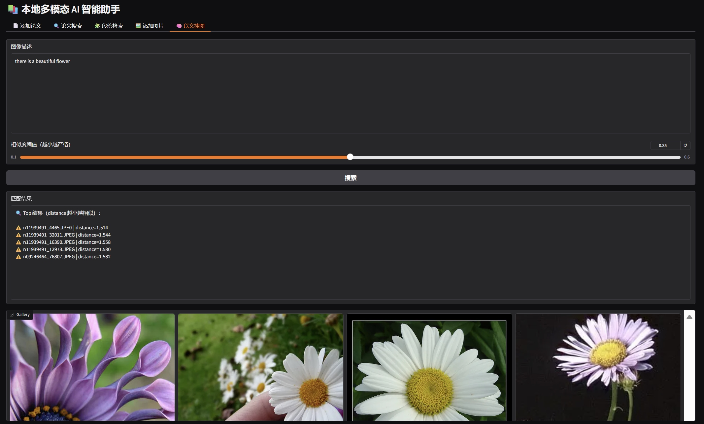

# 📚 本地多模态 AI 智能助手

> 支持：📄 PDF 论文 → 段落级索引 ｜ 🖼 图像 → 以文搜图 ｜ 🤖 本地大模型推理 ｜ 🌐 Web 可视化操作

---

## 1️⃣ 项目整体功能概述

本项目是一个基于 Python 的本地多模态 AI 智能助手，实现了一个 **本地部署的学术论文管理系统**和 **本地图片素材管理系统**，具备完整的工程结构与可视化交互界面。

系统核心能力包括：

- **论文级语义检索**：整篇 PDF 向量化，支持自然语言查询
- **段落级检索**：论文自动切分为段落并建立独立索引
- **以文搜图（跨模态）**：基于 CLIP 的文本 → 图像检索
- **本地大模型推理**：论文主题自动分类（Qwen2.5-14B-Instruct）
- **双入口设计**：WebUI（Gradio）+ CLI（命令行）

---

## 2️⃣ 项目目录结构说明

```text
Experiment2/
├── main.py              # 命令行主入口（CLI）
├── web_ui.py            # Gradio Web 界面（主要演示入口）
├── config.py            # 模型与路径配置
├── batch_add_images.py  # 批量添加图片到数据库中
│
├── modules/             # 核心功能模块（业务逻辑层）
│   ├── pdf_parser.py        # PDF → 文本解析
│   ├── paragraph_splitter.py# 文本 → 段落切分
│   ├── text_encoder.py      # 文本向量（bge-large-zh）
│   ├── image_encoder.py     # 图像 / 文本向量（CLIP）
│   ├── classifier.py        # LLM 论文主题分类
│   ├── search.py            # 向量索引 / 检索（ChromaDB）
│   └── llm.py               # 本地 LLM 接口（Qwen2.5）
│
├── data/
│   ├── papers/          # 原始 PDF（按主题分类存储）
│   ├── images/          # 图片数据
│   └── index/           # 向量索引（ChromaDB 持久化）
│       ├── papers/
│       ├── paragraphs/
│       └── images/
└── README.md
```

📌 **设计说明**：
- `modules/` 是系统核心逻辑层
- `web_ui.py` 和 `main.py` 仅作为不同入口，**不互相依赖**
- 向量索引使用 ChromaDB 持久化存储，支持重启加载

---

## 3️⃣ 核心模块功能说明（函数级）

### 📄 pdf_parser.py

```python
parse_pdf(path) -> str
```
- 功能：解析 PDF 文件并提取纯文本
- 用途：论文入库第一步

---

### ✂️ paragraph_splitter.py

```python
split_paragraphs(text) -> List[str]
```
- 功能：将论文文本按自然段切分
- 特点：保证段落语义完整、长度可控
- 用于 **段落级索引**

---

### 🧠 text_encoder.py

```python
embed_text(text) -> np.ndarray
```
- 模型：`bge-large-zh-v1.5`
- 功能：中文语义向量化
- 用途：论文 / 段落 / 查询统一编码

---

### 🖼 image_encoder.py

```python
embed_image(image) -> np.ndarray
embed_clip_text(text) -> np.ndarray
```
- 模型：CLIP
- 功能：图像与文本映射到同一向量空间
- 用途：以文搜图（跨模态检索）

---

### 🧠 classifier.py

```python
classify_paper(text, topics) -> str
```
- 模型：`Qwen2.5-14B-Instruct（本地）`
- 功能：根据全文内容自动判断论文主题
- 用途：论文自动归类存储

---

### 🔍 search.py

```python
add_paper_embedding(...)
search_paper(...)
add_paragraph(...)
search_paragraph(...)
add_image_embedding(...)
search_image(...)
```
- 底层：ChromaDB（PersistentClient）
- 支持：论文 / 段落 / 图片 三类索引
- 特点：统一向量接口，支持距离排序

---

## 4️⃣ WebUI 使用流程（Gradio）

### 4.1 启动 WebUI

```bash
python web_ui.py
```

浏览器访问：
```
http://localhost:7860
```

---

### 4.2 添加论文（自动分类 + 段落索引）


1. 上传 PDF 文件
2. 输入候选主题（如 `CV,NLP,RL`）
3. 点击「添加论文」

后台自动完成：
- PDF 解析
- LLM 自动分类
- 文档级向量构建
- **段落级向量索引**
- PDF 按主题保存

---

### 4.3 论文语义搜索


- 输入查询（如 `attention mechanism`）
- 返回匹配论文列表

---

### 4.4 段落级检索


- 输入一句自然语言
- 返回：
  - 论文名
  - 段落编号
  - 段落原文

📌 可实现“直接定位论文关键内容”

---

### 4.5 添加图片 & 以文搜图


- 上传图片 → CLIP 图像编码
- 输入文本（如 `pizza with cheese`）
- 返回最相似图片（按 distance 排序）


---

## 5️⃣ 命令行（CLI）使用方式

> CLI 与 WebUI **共用同一套底层模块逻辑**

### 5.1 添加论文

```bash
python main.py add_paper ch2.pdf --topics CV,NLP,RL
```

---

### 5.2 搜索论文

```bash
python main.py search_paper "attention mechanism"
```

---

### 5.3 搜索段落（加分项）

```bash
python main.py search_paragraph "self-attention"
```

---

### 5.4 添加图片

```bash
python main.py add_image pizza.jpg
```

---

### 5.5 以文搜图

```bash
python main.py search_image "pizza with cheese" --threshold 0.35
```

---

## 6️⃣ 项目总结

✅ 完全本地化（无外部 API 依赖）   
✅ 多模态检索（文本 + 图像）  
✅ WebUI / CLI 双入口
---

## 7️⃣ 依赖环境


本项目使用如下 Python 依赖：


```txt
python>=3.8
torch>=2.0
transformers>=4.38.0
accelerate>=0.26.0
sentence-transformers>=2.6.0
Pillow>=9.5.0
numpy>=1.23.0
chromadb>=0.4.24
pypdf>=3.9.0
gradio>=4.25.0
tqdm>=4.65.0
regex>=2023.10.3
```


上述依赖已保存至 `requirements.txt` ，可直接使用下边方法进行安装：


```bash
pip install -r requirements.txt
```

> ⚠️ 说明：
> - 项目默认使用 **GPU（CUDA）** 环境运行
> - 已在 RTX 4090 / 3090 显卡环境下验证
> - 若仅使用 CPU，可将 `torch` 替换为 CPU 版本
